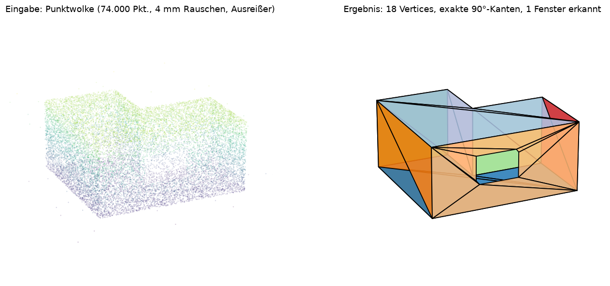
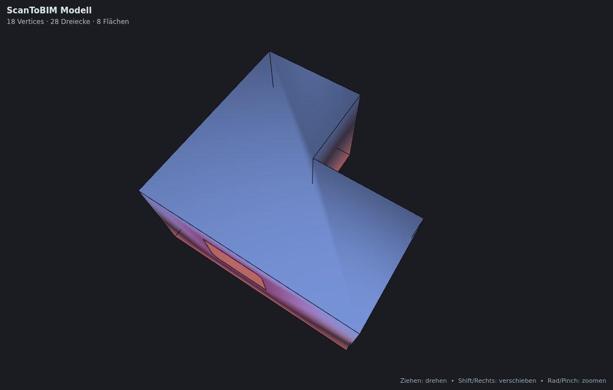
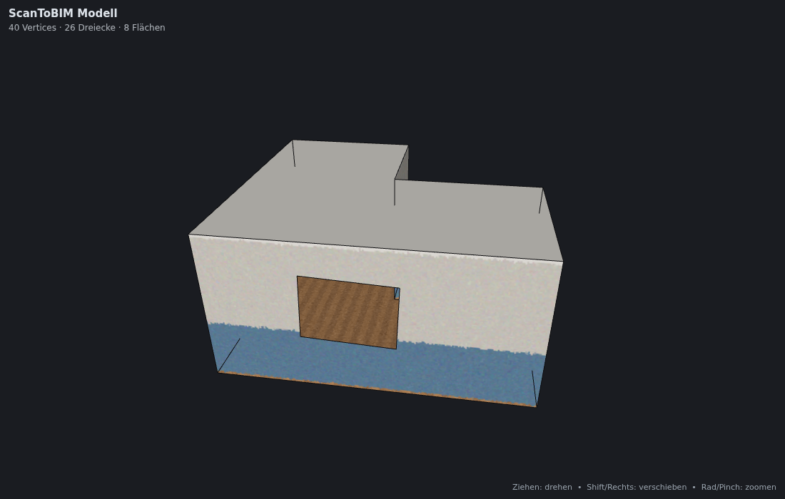
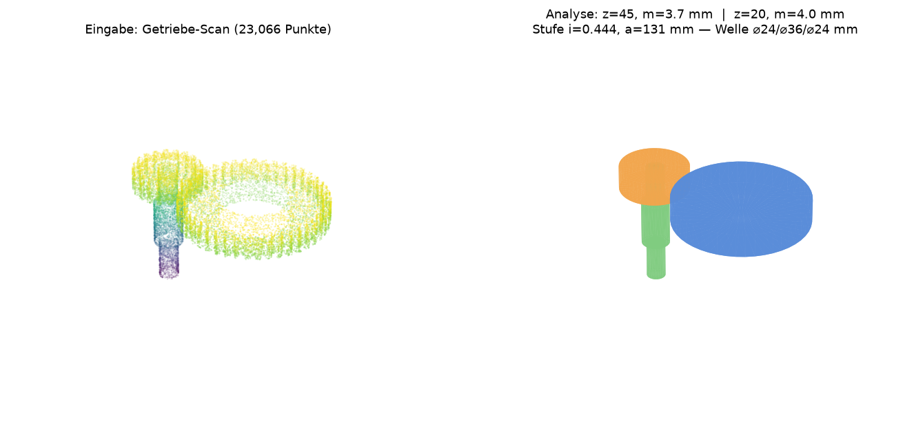

# ScanToBIM – Punktwolken & Fotos → 3D-Modelle mit sauberen Kanten

**ScanToBIM** rekonstruiert aus LiDAR-Punktwolken beliebiger Herkunft
(terrestrische Scanner, Drohnen, iPhone/iPad-LiDAR, Mobile Mapping) und aus
Fotos (Photogrammetrie) professionelle 3D-Modelle mit **sauberen, geraden
Kanten und exakten Winkeln** – statt der üblichen „verwaschenen“
Dreiecksnetze klassischer Flächenrekonstruktion.



> Aus 74.000 verrauschten Scanpunkten (4 mm Sensor­rauschen, 1 % Ausreißer)
> entsteht die **minimale exakte Repräsentation** des Raums: 18 Vertices,
> alle Kanten schnurgerade, alle Winkel exakt 90° – und das Fenster wird als
> echte Öffnung in der Wand rekonstruiert.

> English summary at the bottom of this document.

## Warum saubere Kanten?

Klassische Rekonstruktion (Poisson, Ball-Pivoting, Marching Cubes) mittelt
das Sensorrauschen in die Oberfläche hinein – Kanten werden rund, Wände
wellig, und das Ergebnis ist für CAD/BIM praktisch unbrauchbar. ScanToBIM
geht den Weg der aktuellen Forschung zu strukturierter Rekonstruktion
(Efficient RANSAC, GlobFit, PolyFit, Kinetic Space Partitioning, Point2CAD):

1. **Vorverarbeitung** – Voxel-Ausdünnung (behält echte Messpunkte statt
   Mittelwerte), statistische Ausreißerentfernung, PCA-Normalenschätzung.
   Alle Längen-Parameter werden automatisch aus dem gemessenen Punktabstand
   abgeleitet – dieselben Presets funktionieren für Räume in Metern und
   Bauteile in Millimetern.
2. **Ebenen-Detektion** – normalengestützter RANSAC (1-Punkt-Hypothesen mit
   adaptivem Abbruchkriterium) mit Total-Least-Squares-Refit. Drei
   statistische Gates (RMS, Kern-Konzentration, Surface Variation) weisen
   diffuse Rausch-„Ebenen“ ab; ein Zusammenhangs-Filter trennt koplanare,
   aber räumlich getrennte Flächen.
3. **Regularisierung** – Normalen-Clustering und Manhattan-Snapping: fast
   parallele Ebenen werden exakt parallel, fast rechtwinklige exakt
   rechtwinklig (Toleranzen konfigurierbar); koplanare Duplikate werden zu
   einer logischen Fläche verschmolzen.
4. **Exakte Kantengeometrie** – Kanten werden nicht aus verrauschten Punkten
   „nachgezeichnet“, sondern **mathematisch abgeleitet**: benachbarte
   Ebenen schneiden sich in einer exakten Geraden, drei Ebenen in einem
   exakten Eckpunkt.
5. **Konturpolygone** – pro Ebene: Alpha-Shape-Rand → Douglas-Peucker →
   Begradigung an dominanten Richtungen (O-Snap-Stil) → Snapping der
   Polygone auf die exakten Schnittgeraden und Eckpunkte → Entfernung
   kollinearer Restpunkte.
5b. **Öffnungen** – Innenkonturen der Alpha-Shape (Bereiche ohne Messpunkte
   innerhalb einer Fläche) werden als **Fenster und Türausschnitte** erkannt,
   genauso begradigt wie die Außenkontur und als echte Löcher trianguliert
   (Brücken-Triangulierung mit Sichtbarkeitstest).
6. **Vermaschung & Export** – Ear-Clipping-Triangulierung, Vertex-Welding
   (gemeinsame Kanten werden echte Falze statt Risse – geschlossene Räume
   werden wasserdicht), Export als **OBJ** (mit semantischen Flächengruppen),
   **PLY**, **STL**, **glTF/GLB** (mit Flächenfarben) plus maschinenlesbarem
   **Qualitätsbericht** (JSON).

## Professionelle Zusatzfunktionen

| Funktion | Beschreibung |
| --- | --- |
| 🪟 **Öffnungs-Erkennung** | Fenster/Türen werden als regularisierte Löcher in den Flächen rekonstruiert; Fläche und Anzahl stehen im Bericht (`--no-openings` schaltet ab). |
| 🏷️ **Bauteil-Klassifikation** | Jede Fläche wird als `floor` / `ceiling` / `slab` / `wall` / `sloped` klassifiziert – als OBJ-Gruppennamen (`wall_003`) und im Bericht. |
| 📐 **Mengenermittlung** | Flächen je Bauteilklasse, Grundmaße, Wasserdichtigkeits-Prüfung und **Raumvolumen** (Divergenzsatz) – die Zahlen, nach denen abgerechnet wird. |
| 🧭 **Auto-Ausrichtung** (`--align`) | Dominante Richtungen werden auf die X/Y/Z-Achsen gedreht, der Boden auf Z=0 gelegt; die 4x4-Transformation steht reversibel im Bericht. |
| 🔗 **Multi-Scan-Registrierung** (`scantobim register`) | Getrimmtes Punkt-zu-Ebene-ICP registriert grob vorausgerichtete Scans aufeinander und verschmilzt sie (Transformationen als JSON exportierbar). |
| 📄 **DXF-Grundriss** (`--floorplan plan.dxf`) | Horizontalschnitt (Standard: 1 m über Boden) als AutoCAD-R12-DXF – direkt nutzbar in AutoCAD, LibreCAD, QCAD, BricsCAD. |
| 🌐 **Interaktiver HTML-Viewer** (`-o model.html`) | Eine einzige HTML-Datei mit eingebettetem WebGL-Renderer: Orbit/Pan/Zoom, Flächenfarben, schwarze Kantenlinien. Läuft offline in jedem Browser – ideal zum Weitergeben an Kunden, keine Software nötig. |
| 📦 **Mehrere Eingangsdateien** | `scantobim reconstruct scan1.laz scan2.e57 wolke.ply -o model.glb` verschmilzt beliebig viele Quellen zu einem Modell; `--register-inputs` registriert sie vorher per ICP. |
| 📷 **Foto-Texturierung** (`--texture`) | Die RGB-Daten der Punktwolke (Photogrammetrie, RGB-Scanner) werden als Textur-Atlas auf die sauberen Flächen gebacken – fotorealistische Darstellung auf exakter Geometrie. Auflösung folgt der Punktdichte (`--texel` überschreibt). |
| 📸 **Foto-Projektion** (`--texture-photos`) | Noch schärfer: Die Originalfotos werden über die COLMAP-Kameraposen direkt auf das Modell projiziert – pro Texel wählt ScanToBIM das am besten blickende, **nicht verdeckte** Foto (Verdeckung wird gegen das Modell selbst per Ray-Test geprüft). Volle Fotoauflösung auf dem Modell. |
| ⚙️ **STEP-Export** (`-o model.stp`) | Echtes CAD-B-Rep (AP214): analytische Ebenen, exakte Kantenzüge, Öffnungen als Innenkonturen; wasserdichte Modelle als Volumenkörper (`MANIFOLD_SOLID_BREP`). Importierbar in SolidWorks, Inventor, Fusion, FreeCAD, AutoCAD und **HiCAD**. |
| 🏗️ **IFC-Export** (`-o model.ifc`) | IFC4-Bauwerksmodell: Wände als `IfcWall`, Böden als `IfcSlab`, Decken als `IfcCovering` – inkl. Projekt/Gebäude/Geschoss-Struktur und Fenster-Öffnungen. Öffnet in Revit, ArchiCAD, Solibri, BlenderBIM. |



## Fotorealistische Darstellung

Die Fotodaten landen nicht nur in der Geometrie, sondern auch auf ihr:



> Punktwolken-Farben auf das rekonstruierte Modell gebacken – Wandfarbe,
> Sockel und Parkett bleiben fotorealistisch, die Kanten bleiben exakt.
> Durch die rekonstruierte Fensteröffnung ist der texturierte Boden sichtbar.

```bash
# Textur aus den RGB-Farben der Punktwolke (Photogrammetrie / RGB-Scanner)
scantobim reconstruct wolke.ply -o model.html --texture

# Maximale Schärfe: Originalfotos via COLMAP-Kameraposen projizieren
scantobim photos ./fotos -o wolke.ply           # schreibt auch model_txt/
scantobim reconstruct wolke.ply -o model.glb \
    --texture-photos ./fotos --colmap-model wolke_colmap/model_txt
```

Texturen landen eingebettet im GLB (PBR-Material mit `baseColorTexture`),
im HTML-Viewer (Base64) und als OBJ+MTL+PNG-Trio; PLY/STL/STEP/IFC bleiben
reine Geometrie. UV-Atlas mit Gutter gegen Kantenbluten, Löcher (Verdeckung,
dünn besetzte Stellen) werden per Nächster-Nachbar-Inpainting gefüllt.

## Industrie-Modus: Maschinenbau & Stahlbau

`scantobim analyze` vermisst rotatorische Maschinengeometrie und Stahltragwerke
direkt aus der Punktwolke – Reverse Engineering für Bestandsanlagen:



| Erkennung | Ausgabe |
| --- | --- |
| **Zylinder** | Rohre, Lagerzapfen, Bohrungen, Säulen: Achse, Durchmesser, Länge, RMS (normalenbasiertes RANSAC mit Kleinste-Quadrate-Verfeinerung und Winkelabdeckungs-Gate). |
| **Wellen** (auch abgesetzt) | Koaxiale Zylinderketten werden zu Wellen gruppiert: Absätze in Reihenfolge mit ⌀/Länge/Position – die Maße für die Nachfertigung. |
| **Zahnräder** (Stirnräder) | Zähnezahl über FFT des Winkel-Radius-Profils, Kopf-/Fußkreis, **Modul nach DIN** (m = da/(z+2)), Teilkreis, Zahnbreite. Achse wird über Stirnflächen-Normalen präzisiert; kämmende Räder in einem Cluster werden über ihre Kopfkreis-Zylinder getrennt. |
| **Getriebestufen** (Großgetriebe) | Kämmende Radpaare aus parallelen Achsen im Teilkreis-Achsabstand: Übersetzung i und Achsabstand a je Stufe. |
| **Stahlprofile** | Längliche Bauteil-Cluster werden vermessen (Achse, h × b, Länge, Steglage) und gegen die Walzprofil-Kataloge **IPE / HEA / HEB / UPN** (DIN 1025/1026) gematcht – inkl. Abweichung vom Katalogmaß. |

```bash
# Getriebe / Anlage analysieren: JSON-Bericht + Primitiv-Mesh
scantobim analyze getriebe.e57 -o analyse.json --mesh primitive.glb

# Stahltragwerk: Profile identifizieren
scantobim analyze halle.laz -o traeger.json
```

Hinweis Genauigkeit: freistehende Räder werden am genauesten vermessen; im
Zahneingriff kann der Kopfkreis des Großrads leicht unterschätzt werden.

## CAD-Übergabe: STEP & HiCAD

`-o model.stp` schreibt ein **echtes B-Rep** (keine Dreiecksfacetten): jede
Fläche als analytische `PLANE` mit exakten Kantenzügen, gemeinsame Kanten
zwischen Flächen werden geteilt (`EDGE_CURVE`), Öffnungen sind Innenkonturen.
Wasserdichte Gebäude werden als Volumenkörper exportiert.

**HiCAD (ISD):** Das native `.SZA`-Format ist proprietär und kann nur von
HiCAD selbst geschrieben werden. Der dokumentierte Übergabeweg ist STEP:
in HiCAD über *Datei → Import → STEP* die von ScanToBIM erzeugte `.stp`
laden – Flächen, Kanten und Öffnungen kommen dort als editierbare
CAD-Geometrie an.

## Unterstützte Eingaben

| Quelle | Format | Hinweis |
| --- | --- | --- |
| Terrestrische/mobile Laserscanner | `.las`, `.laz` | via laspy, `.laz` mit `pip install scantobim[laz]` |
| Scanner-Austauschformat | `.e57` | optional: `pip install scantobim[e57]` |
| Photogrammetrie (COLMAP, Metashape, RealityCapture, Meshroom) | `.ply`, `.las` | dichte Punktwolke exportieren |
| **Fotos direkt** | `.jpg`, `.png`, … | `scantobim photos` ruft ein lokal installiertes [COLMAP](https://colmap.github.io) auf (SfM + MVS, mit Sparse-Fallback ohne CUDA) |
| 3D Gaussian Splatting / NeRF | `.ply` | Positionen werden gelesen, SH-Koeffizienten ignoriert |
| iPhone/iPad LiDAR-Apps | `.ply`, `.e57`, `.xyz` | z. B. Scaniverse, Polycam, 3d Scanner App |
| PCL / Leica Cyclone / Textformate | `.pcd`, `.pts`, `.xyz`, `.txt`, `.csv` | inkl. Intensität und RGB |

## Installation

Voraussetzung: Python ≥ 3.10.

```bash
pip install .                 # aus diesem Repository
pip install .[laz]            # + LAZ-Unterstützung (empfohlen)
pip install .[laz,e57,photos] # + E57 + Foto-Projektions-Texturierung
```

Für den Foto-Workflow zusätzlich COLMAP installieren
(`apt install colmap` bzw. [Anleitung](https://colmap.github.io/install.html)).

## Schnellstart

```bash
# Punktwolke inspizieren
scantobim info scan.laz

# Rekonstruktion: Gebäude von außen
scantobim reconstruct scan.laz -o model.glb --preset building --report report.json

# Innenraum-Scan (Normalen zeigen nach innen)
scantobim reconstruct raum.e57 -o raum.obj --preset indoor

# Fotos → Punktwolke → Modell
scantobim photos ./fotos -o wolke.ply
scantobim reconstruct wolke.ply -o model.glb

# Mehrere Eingangsdateien direkt zu einem Modell (beliebige Formate mischen)
scantobim reconstruct standpunkt1.laz standpunkt2.e57 drohne.ply -o model.glb
scantobim reconstruct s1.ply s2.ply --register-inputs -o model.glb  # mit ICP

# CAD/BIM-Export
scantobim reconstruct scan.laz -o model.stp   # STEP B-Rep (auch für HiCAD)
scantobim reconstruct raum.e57 -o model.ifc --preset indoor  # IFC4-Bauteile

# Oder explizit registrieren und Zwischenergebnis behalten
scantobim register standpunkt1.ply standpunkt2.ply standpunkt3.ply -o gesamt.ply

# Achsen ausrichten, Grundriss als DXF, interaktiver Browser-Viewer
scantobim reconstruct scan.laz -o model.html --align --floorplan grundriss.dxf

# Nicht erklärte Punkte (Möbel, Vegetation, …) separat sichern
scantobim reconstruct scan.las -o model.obj --residual-out rest.ply
```

Als Python-Bibliothek:

```python
from scantobim import PipelineConfig, reconstruct
from scantobim.io import read_point_cloud, write_mesh

cloud = read_point_cloud("scan.laz")
result = reconstruct(cloud, PipelineConfig.preset("indoor"))
write_mesh(result.mesh, "model.glb")
print(result.report["plane_angles"])   # z. B. 21x exakt orthogonal, 7x exakt parallel
```

## Presets & wichtige Parameter

| Preset | Einsatz | Besonderheit |
| --- | --- | --- |
| `building` | Gebäude/Objekte von außen | Normalen zeigen nach außen |
| `indoor` | Innenraum-Scans | Normalen zeigen nach innen, tolerantere Normalen-Gates |
| `object` | Bauteile, Möbel, CAD-artige Objekte | höhere Mindest-Inlier-Quote |
| `fast` | Schneller Vorschau-Durchlauf | weniger RANSAC-Iterationen |

Alle Parameter sind über `PipelineConfig` bzw. CLI-Flags zugänglich, u. a.
`--voxel` (Ausdünnung), `--dist` (RANSAC-Toleranz), `--max-planes`,
`--no-regularize`, `--no-straighten`, `--seed`. Nicht gesetzte Längen
werden automatisch aus dem Punktabstand abgeleitet.

## Qualitätsbericht

`--report report.json` schreibt u. a.: Punktzahlen je Verarbeitungsschritt,
Ebenen mit RMS/Fläche/Normale/Bauteilklasse/Öffnungen, Winkelstatistik (wie
viele Ebenenpaare exakt parallel/orthogonal sind), Anzahl exakter Ecken,
Mengenermittlung (Flächen je Klasse, Volumen, Wasserdichtigkeit),
Ausrichtungs-Transformation und Laufzeit.

## Grenzen & Ausblick

- Die Pipeline ist auf **planare Strukturen** optimiert (Architektur,
  Innenräume, CAD-artige Objekte). Organische Formen landen im
  Residuum (`--residual-out`) – dafür optional Open3D-Poisson nutzen
  (`pip install scantobim[viz]`).
- Die ICP-Registrierung ist eine Fein-Registrierung; Scans müssen grob
  vorausgerichtet sein (Scanner-Software, gemeinsame Georeferenz).
- Zahnradvermessung: Gerad-Stirnräder (Schräg-/Kegelräder auf der Roadmap);
  Stahlprofile: I/H- und U-Familien (L-Winkel und Hohlprofile geplant).
- Geplant: Mehrgeschoss-Klassifikation, IfcOpeningElement-Beziehungen,
  Kegel-/Torus-Primitive, natives Hohlprofil-Matching.

## Entwicklung

```bash
pip install -e .[dev]
pytest          # 112 Tests: IO-Roundtrips, Algorithmen, End-to-End-Qualitätsgates
python examples/demo.py   # erzeugt Beispiel-Scan + Modell + Viewer in demo_output/
```

Die End-to-End-Tests prüfen harte Qualitätskriterien: exakte 90°-Winkel,
Eckpunkt-Genauigkeit < 3 cm bei 4 mm Rauschen, Wasserdichtigkeit
geschlossener Räume, Erhalt offener Ränder, Determinismus bei festem Seed
und Abweisung strukturlosen Rauschens.

## Stand der Technik – Referenzen

- Schnabel, Wahl, Klein: *Efficient RANSAC for Point-Cloud Shape Detection*, CGF 2007
- Li et al.: *GlobFit: Consistently Fitting Primitives by Discovering Global Relations*, SIGGRAPH 2011
- Arikan et al.: *O-Snap: Optimization-Based Snapping for Modeling Architecture*, TOG 2013
- Nan, Wonka: *PolyFit: Polygonal Surface Reconstruction from Point Clouds*, ICCV 2017
- Bauchet, Lafarge: *Kinetic Shape Reconstruction*, TOG 2020
- Schönberger, Frahm: *Structure-from-Motion Revisited* (COLMAP), CVPR 2016
- Kerbl et al.: *3D Gaussian Splatting for Real-Time Radiance Field Rendering*, SIGGRAPH 2023 (als Foto-Capture-Frontend)
- Liu et al.: *Point2CAD: Reverse Engineering CAD Models from 3D Point Clouds*, CVPR 2024
- Pauly, Gross, Kobbelt: *Efficient Simplification of Point-Sampled Surfaces* (Surface Variation), VIS 2002

---

## English summary

**ScanToBIM** turns LiDAR point clouds of any origin (`.las/.laz`, `.e57`,
`.ply`, `.pcd`, `.pts/.xyz/.csv` — terrestrial scanners, drones,
iPhone/iPad LiDAR, photogrammetry exports, Gaussian-Splatting PLYs) and photo
sets (via a bundled COLMAP wrapper with sparse fallback) into **clean-edged,
CAD/BIM-ready 3D models**. Instead of smoothing noise into wavy meshes, it
detects planar structure with normal-aware RANSAC (with statistical noise
gates and connected-component filtering), regularizes plane orientations to
exact parallel/orthogonal relations (Manhattan snapping), derives edges
*mathematically* as plane–plane intersection lines and 3-plane corner
points, extracts per-plane boundary polygons (alpha shape → simplification →
dominant-direction straightening) snapped onto those exact edges, and welds
everything into a watertight-where-possible mesh. **Windows and door cutouts
are reconstructed as true regularized holes**; every surface is classified
(floor/ceiling/slab/wall/sloped) and a quantity takeoff (areas per class,
room volume via divergence theorem, watertightness) lands in the JSON
report. Extras: automatic axis alignment with floor at Z=0 (`--align`),
trimmed point-to-plane **ICP multi-scan registration**
(`scantobim register`), **DXF floor plan export** (`--floorplan`), and a
**self-contained interactive HTML viewer** (`-o model.html` — embedded
WebGL, orbit controls, crease-edge overlay, works offline in any browser).
Multiple input files merge into one model (`--register-inputs` runs ICP
first). **Photo-realistic texturing**: `--texture` bakes the cloud's RGB
into a UV texture atlas on the clean surfaces; `--texture-photos` projects
the original photos via COLMAP camera poses, per-texel choosing the best
non-occluded view (occlusion ray-tested against the model itself) —
full photo resolution on exact geometry, exported as GLB (PBR
baseColorTexture), standalone HTML viewer, or OBJ+MTL+PNG.
Exports: OBJ (semantic surface groups), PLY, STL, glTF/GLB, HTML,
**STEP AP214** (true planar B-rep with shared edges and hole loops — solids
for watertight models; the documented exchange route into HiCAD, which
imports STEP natively) and **IFC4** (IfcWall/IfcSlab/IfcCovering with
project/building/storey structure). The industrial mode
(`scantobim analyze`) reverse-engineers machinery: cylinders, stepped
shafts (step diameters/lengths), spur gears (tooth count via FFT of the
angular radius profile, DIN module, tip/root circles, face width — meshing
gears are separated via their tip-circle cylinders), gear stages
(transmission ratio + center distance) and steel members matched against
the IPE/HEA/HEB/UPN catalogs. A synthetic 74k-point room scan with 4 mm
noise reconstructs to its minimal exact representation — 18 vertices, all
angles exactly 90°, window included. Pure Python (numpy/scipy/laspy),
112 tests, MIT license. CLI:
`scantobim reconstruct scan.laz -o model.stp --preset indoor`.

## Lizenz

MIT – siehe [LICENSE](LICENSE).
